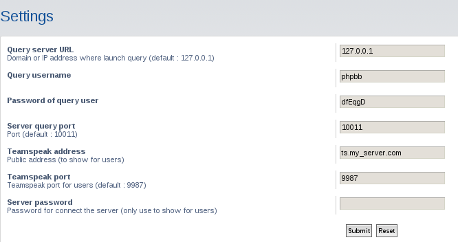

Teamspeak extension for phpbb 3.1.x
===================================

[https://github.com/geekariom/phpbb-ts3](https://github.com/geekariom/phpbb-ts3)

WIP
===

This extension is under construction, 

Install
=======

Download this code and copy it in your phpbb install under the `ext` directory.
You should have this path : `phpbb_install/ext/matthieuy/teamspeak`

- Go into your ACP => Customise => Manage extension
- Enable this extension
- Enjoy

For stats, add this crontab :
```
* * * * * php /PHPBB_ROOTPATH/bin/phpbbcli.php ts3:stats
```

Screenshots
===========

Teamspeak page :


ACP :



Number of users :


Develop
=======

You can propose pull request or open a issue if you need more informations.

Licence :
=========

This code is under [GNU GPL 2.0](http://opensource.org/licenses/gpl-2.0.php)

Changelog
=========

- v1.0.0 (03/01/2016) :
    - First commit

TODO
====

- Top user number in var
- Remove shoutbox dependency
- Unit tests
